# Bosch production line performance
In this [competition](https://www.kaggle.com/c/bosch-production-line-performance/) we need to predict internal failures using thousands of measurements and tests made for each component along the assembly line. 

The data for this competition represents measurements of parts as they move through Bosch's production lines. Each part has a unique Id. The goal is to predict which parts will fail quality control (represented by a 'Response' = 1).

The dataset contains an extremely large number of anonymized features. Features are named according to a convention that tells you the production line, the station on the line, and a feature number. E.g. L3_S36_F3939 is a feature measured on line 3, station 36, and is feature number 3939.

## Libraries

```python
import numpy as np # linear algebra
import pandas as pd # data processing, CSV file I/O (e.g. pd.read_csv)
import zipfile
import os
from collections import Counter
import matplotlib.pyplot as plt
from functools import reduce
from tqdm.notebook import tqdm
from scipy import sparse
import gc
from sklearn.model_selection import StratifiedKFold
from xgboost import XGBClassifier
import xgboost as xgb
from numba import jit
from sklearn.metrics import matthews_corrcoef
from sklearn.metrics import roc_auc_score
from scipy.stats import spearmanr
import numba
from scipy.sparse import csr_matrix
import pickle
from bayes_opt import BayesianOptimization
from functools import partial
```

Let's have a look at the contents of the zipped files:


```python

for dirname, _, filenames in os.walk('./data'):
    
    for filename in filenames:
        
        pth    = os.path.join(dirname, filename)
        zf     = zipfile.ZipFile(pth)
        size   = sum([zinfo.file_size for zinfo in zf.filelist])
        zip_mb = float(size) / 1000 ** 2  # MB
        
        fields_all = 0
        fields_mis = 0

        for file in zf.filelist:
            with zf.open(file, 'r') as f:
                for zip_line_idx, zip_line in enumerate(f):
                    if zip_line_idx <= 5: # Parse the first lines to check for missing values
                        line = zip_line.decode("utf-8").split(',')           # Convert to string and split elements
                        fields_mis += np.sum([field == '' for field in line]) # Get no. fields missing
                        fields_all += len(line)                               # Get total no. fields
        
        # Print info
        print(f'Path:\t{pth}')
        print(f'Name:\t {zf.namelist()}')
        print(f'Size:\t {zip_mb} MB')
        print(f'Rows:\t {zip_line_idx}')
        print(f'% Mis:\t {round(fields_mis / fields_all * 100, 3)}')
```

    Path:	./data\sample_submission.csv.zip
    Name:	 ['sample_submission.csv']
    Size:	 11.281556 MB
    Rows:	 1183748
    % Mis:	 0.0
    Path:	./data\test_categorical.csv.zip
    Name:	 ['test_categorical.csv']
    Size:	 2678.272381 MB
    Rows:	 1183748
    % Mis:	 80.126
    Path:	./data\test_date.csv.zip
    Name:	 ['test_date.csv']
    Size:	 2893.227216 MB
    Rows:	 1183748
    % Mis:	 65.802
    Path:	./data\test_numeric.csv.zip
    Name:	 ['test_numeric.csv']
    Size:	 2137.286201 MB
    Rows:	 1183748
    % Mis:	 65.635
    Path:	./data\train_categorical.csv.zip
    Name:	 ['train_categorical.csv']
    Size:	 2678.343036 MB
    Rows:	 1183747
    % Mis:	 81.784
    Path:	./data\train_date.csv.zip
    Name:	 ['train_date.csv']
    Size:	 2893.367134 MB
    Rows:	 1183747
    % Mis:	 68.655
    Path:	./data\train_numeric.csv.zip
    Name:	 ['train_numeric.csv']
    Size:	 2139.901506 MB
    Rows:	 1183747
    % Mis:	 67.285
    

So, we have 1183747 rows for train and 1183748 for test, and the train / test files seem to be aligned in terms of rows.
Moveover, by scanning through the first 50k lines on each file, it is clear that the dataset is sparse.
train and test date files: 82% missing
train and test numerical files: 81% missing
train and test categorical files: 97% missing.

We should probably move to a sparse storage / loading format.

## Headers


```python
datadir = './data/'

date_header = pd.read_csv(datadir + 'train_date.csv.zip', nrows = 1).columns.to_list()
num_header  = pd.read_csv(datadir + 'train_numeric.csv.zip', nrows = 1).columns.to_list()
cat_header  = pd.read_csv(datadir + 'train_categorical.csv.zip', nrows = 1).columns.to_list()
all_header  = date_header + num_header + cat_header
print('Duplicate columns:', [item for item, count in Counter(all_header).items() if count > 1])
print('All columns:', len(set(all_header)))

```

    Duplicate columns: ['Id']
    All columns: 4266
    

So in total we have approximately 1.1 mln rows, 4000 features...

ID should be treated as our index. 

Let's see how many stations, lines and features we have:


```python
def extract_line(colname):    return colname.split('_')[0]
def extract_station(colname): return colname.split('_')[1]
def extract_feature(colname): return colname.split('_')[2]

feat_headers = [header for header in num_header + cat_header if header != 'Id' and header != 'Response']

feat_counter = []

lines = set([extract_line(header) for header in feat_headers])
for line in lines:
    stations = set([extract_station(header) for header in feat_headers if extract_line(header) == line])
    for station in stations:
        feats = [extract_feature(header) for header in feat_headers if extract_line(header) == line and extract_station(header) == station]
        feat_counter.append((line, station, len(feats)))
        
f = pd.DataFrame(feat_counter, columns=['line', 'station', 'no_feats'])
for line, group in f.groupby('line'):
    
    total_feats = sum(group['no_feats'])
    group.plot(kind = 'bar', x = 'station', y = 'no_feats', figsize = (15, 3), title = f'Line {line}: Total features {total_feats}')
```


    
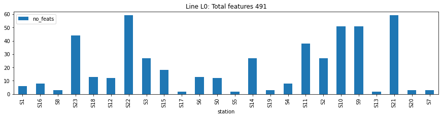
    


    
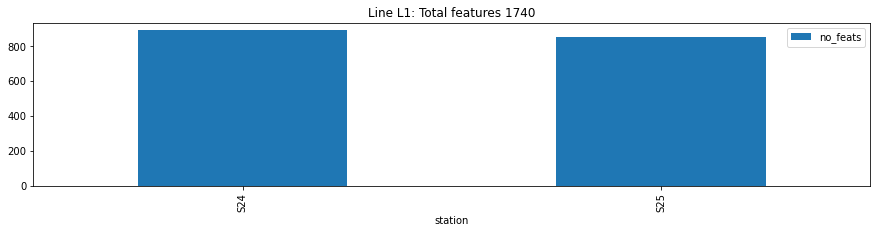
    


    
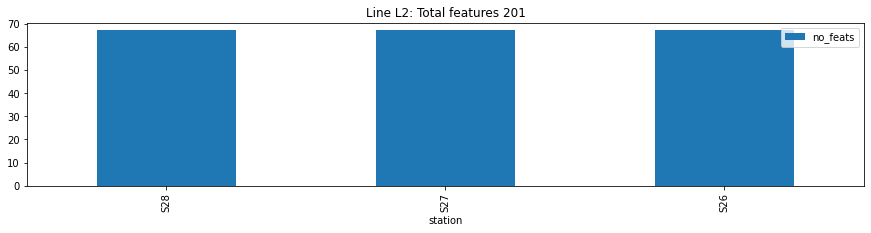
    


    
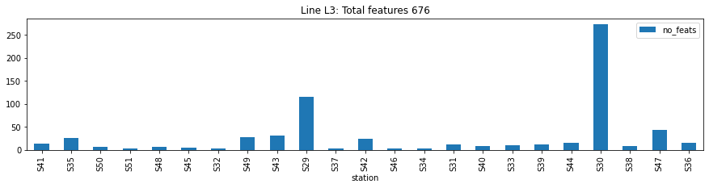
    


It might be a good idea to have a look at the data per Line. In the case of Line L1 (with 1740 features), we could go a level deeper and check on a per-station level.

We need a function to load an entire csv without running out of memory (sparse dataframe)


```python
# Function to load a dataframe from an input file
def load_df(input_file, d_type, fill_value, chunksize):
    
    no_rows = 1183747 # This corresponds to the training set. The test set has one additional element
    reader = pd.read_csv(input_file, chunksize = chunksize, engine = 'c', compression = 'zip', index_col = 'Id', dtype = d_type)

    dfs = []

    for df_chunk in tqdm(reader, total = no_rows // chunksize + 1):
        dfs.append(df_chunk.astype(pd.SparseDtype(d_type, fill_value = fill_value)))

    df = pd.concat(dfs, axis = 0)
    
    df.index = df.index.astype(int)

    return df
```


```python
df_num = load_df(input_file = datadir + 'train_numeric.csv.zip', d_type = np.float64, fill_value = np.nan, chunksize = 200000)
y      = df_num['Response'].values
df_num.drop('Response', axis = 1, inplace = True)
```


      0%|          | 0/6 [00:00<?, ?it/s]


### Response


```python
print(f"No. positive: {np.sum(y == 1)}")
print(f"No. negative: {np.sum(y == 0)}")
print(f"Ratio [%]: {np.sum(y == 1) / np.sum(y == 0)*100}")
```

    No. positive: 6879
    No. negative: 1176868
    Ratio [%]: 0.5845175499716195
    

Highly imbalanced

### Make KFold sets and holdout set


```python
# Train/test split of sklearn takes quite a bit of time
# The following is faster to get a stratified train/test split
def train_test_split(y, test_ratio):
    
    # Grab indices of positive and negative responses
    pos_idx = np.where(y == 1)[0]
    neg_idx = np.where(y == 0)[0]

    # Shuffle them
    np.random.seed(220)
    pos_idx = np.random.permutation(pos_idx)

    np.random.seed(220)
    neg_idx = np.random.permutation(neg_idx)

    # Split on train and test sets
    pos_samples = pos_idx.shape[0]
    neg_samples = neg_idx.shape[0]

    # Grab indices for the holdout set
    pos_idx_hold = pos_idx[:np.floor(pos_samples * test_ratio).astype(int)]
    neg_idx_hold = neg_idx[:np.floor(neg_samples * test_ratio).astype(int)]

    # Grab indices for the training set
    pos_idx_train = np.setdiff1d(pos_idx, pos_idx_hold)
    neg_idx_train = np.setdiff1d(neg_idx, neg_idx_hold)

    # Merge them
    idx_hold  = np.hstack([pos_idx_hold, neg_idx_hold])
    idx_train = np.hstack([pos_idx_train, neg_idx_train])
    
    # Shuffle once more
    np.random.seed(220)
    idx_hold = np.random.permutation(idx_hold)
    np.random.seed(220)
    idx_train = np.random.permutation(idx_train)
    
    return idx_train, idx_hold
```


```python
# Holdout set
holdout_ratio = 0.1 # Ratio of total for holdout set
no_CV_folds   = 5   # Stratified kfold splits

idx_trainval, idx_hold = train_test_split(y, test_ratio = 0.1)
skf = StratifiedKFold(n_splits = no_CV_folds, random_state = 300, shuffle = True)
```


```python
# Make holdout set target
y_holdout   = y[idx_hold]

# Make training / validation set target
y_train   = y[idx_trainval]
```

## Numerical Features
### Missing Values


```python
# Split train / holdout set
holdout_num = df_num.iloc[idx_hold]
train_num   = df_num.iloc[idx_trainval]
```


```python
no_samples = train_num.shape[0]

(train_num.isna().sum()/no_samples * 100).plot(kind = 'bar', xticks = [], figsize = (15, 4), 
                                               title = '% Missing - Numerical',
                                               xlabel = 'Numerical Feature',
                                               ylabel = '% Missing');
```


    
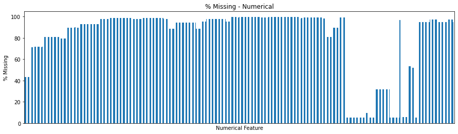
    


Quite a lot of variables are missing most of their values. Experimentation with various imputation methods is useless.

### Numerical Feature Importance

We need a quick way to sort through the numerical features and find the most useful ones. We'll do this with xgboost, by fitting a model on 30% of the training set on the first fold:


```python
X = train_num.reset_index() # Use ID as well

# Grab first fold
for trainval_idx, test_idx in skf.split(X, y_train): break

# Subsample the training set and validation sets of the first fold
train_idx, val_idx = train_test_split(y_train[trainval_idx], test_ratio = 0.7)
val_idx,_          = train_test_split(y_train[val_idx], test_ratio = 0.7)

# Make training and validation datasets
X_train, X_val  = X.iloc[train_idx].values, X.iloc[val_idx].values
y_train_        = y[train_idx].to_dense().astype(int)
y_val_          = y[val_idx].to_dense().astype(int)
    
# Fit model
sum_neg, sum_pos = np.sum(y_train_ == 0), np.sum(y_train_ == 1)
xgb = XGBClassifier(n_estimators = 50, use_label_encoder = False, scale_pos_weight = sum_neg / sum_pos)
xgb.fit(X_train, y_train_, 
        eval_set    = [(X_train, y_train_), (X_val, y_val_)],
        eval_metric = 'logloss', 
        verbose     = True)

# Evaluate performance
y_pred = [round(value) for value in xgb.predict(X_val)]
print('Validation Set ROC-AUC: ', roc_auc_score(y_val_, y_pred))    

# Compute feature importance
xgb_imp = pd.DataFrame({'feature' : X.columns, 'importance': xgb.feature_importances_})
xgb_imp.to_csv('./xgb_imp.csv')
```

    [0]	validation_0-logloss:0.68676	validation_1-logloss:0.68687
    [1]	validation_0-logloss:0.67690	validation_1-logloss:0.67698
    [2]	validation_0-logloss:0.66744	validation_1-logloss:0.66782
    [3]	validation_0-logloss:0.65936	validation_1-logloss:0.65977
    [4]	validation_0-logloss:0.64891	validation_1-logloss:0.64960
    [5]	validation_0-logloss:0.63440	validation_1-logloss:0.63546
    [6]	validation_0-logloss:0.62913	validation_1-logloss:0.63040
    [7]	validation_0-logloss:0.61979	validation_1-logloss:0.62119
    [8]	validation_0-logloss:0.61614	validation_1-logloss:0.61778
    [9]	validation_0-logloss:0.61179	validation_1-logloss:0.61356
    [10]	validation_0-logloss:0.60446	validation_1-logloss:0.60642
    [11]	validation_0-logloss:0.59871	validation_1-logloss:0.60077
    [12]	validation_0-logloss:0.59487	validation_1-logloss:0.59701
    [13]	validation_0-logloss:0.58668	validation_1-logloss:0.58914
    [14]	validation_0-logloss:0.58275	validation_1-logloss:0.58520
    [15]	validation_0-logloss:0.58065	validation_1-logloss:0.58305
    [16]	validation_0-logloss:0.57742	validation_1-logloss:0.57984
    [17]	validation_0-logloss:0.57523	validation_1-logloss:0.57772
    [18]	validation_0-logloss:0.57275	validation_1-logloss:0.57526
    [19]	validation_0-logloss:0.56842	validation_1-logloss:0.57098
    [20]	validation_0-logloss:0.56509	validation_1-logloss:0.56780
    [21]	validation_0-logloss:0.56346	validation_1-logloss:0.56614
    [22]	validation_0-logloss:0.55953	validation_1-logloss:0.56225
    [23]	validation_0-logloss:0.55768	validation_1-logloss:0.56037
    [24]	validation_0-logloss:0.55262	validation_1-logloss:0.55544
    [25]	validation_0-logloss:0.55117	validation_1-logloss:0.55405
    [26]	validation_0-logloss:0.54947	validation_1-logloss:0.55225
    [27]	validation_0-logloss:0.54761	validation_1-logloss:0.55026
    [28]	validation_0-logloss:0.53943	validation_1-logloss:0.54239
    [29]	validation_0-logloss:0.53164	validation_1-logloss:0.53495
    [30]	validation_0-logloss:0.52688	validation_1-logloss:0.53040
    [31]	validation_0-logloss:0.52450	validation_1-logloss:0.52812
    [32]	validation_0-logloss:0.52013	validation_1-logloss:0.52382
    [33]	validation_0-logloss:0.51675	validation_1-logloss:0.52057
    [34]	validation_0-logloss:0.51573	validation_1-logloss:0.51967
    [35]	validation_0-logloss:0.50930	validation_1-logloss:0.51359
    [36]	validation_0-logloss:0.50238	validation_1-logloss:0.50705
    [37]	validation_0-logloss:0.49844	validation_1-logloss:0.50311
    [38]	validation_0-logloss:0.49361	validation_1-logloss:0.49834
    [39]	validation_0-logloss:0.49226	validation_1-logloss:0.49695
    [40]	validation_0-logloss:0.49039	validation_1-logloss:0.49517
    [41]	validation_0-logloss:0.48507	validation_1-logloss:0.49002
    [42]	validation_0-logloss:0.48246	validation_1-logloss:0.48746
    [43]	validation_0-logloss:0.47789	validation_1-logloss:0.48303
    [44]	validation_0-logloss:0.47599	validation_1-logloss:0.48111
    [45]	validation_0-logloss:0.47422	validation_1-logloss:0.47938
    [46]	validation_0-logloss:0.46945	validation_1-logloss:0.47466
    [47]	validation_0-logloss:0.46167	validation_1-logloss:0.46711
    [48]	validation_0-logloss:0.45269	validation_1-logloss:0.45824
    [49]	validation_0-logloss:0.44634	validation_1-logloss:0.45227
    

    C:\Users\kalika01\Anaconda\envs\pytorch_gpu\lib\site-packages\xgboost\data.py:114: UserWarning: Use subset (sliced data) of np.ndarray is not recommended because it will generate extra copies and increase memory consumption
      "because it will generate extra copies and increase " +
    

    Validation Set ROC-AUC:  0.6133061067065692
    


```python
# Plot feature importance and export
file_path = './xgb_imp.csv'
xgb_imp = pd.read_csv(file_path, index_col = 0)
xgb_imp.sort_values(by = 'importance', ascending = False, inplace = True)

fig = plt.figure(figsize = (15, 5))
plt.bar(np.arange(xgb_imp.shape[0]), xgb_imp['importance'])
plt.hlines(xgb_imp['importance'].max() * 0.3, xmin = 0, xmax = xgb_imp.shape[0], color = 'red')
plt.title('XGBoost Numerical Feature Importance');
plt.ylabel('Importance');
plt.xlabel('Feature #');
plt.ylim([0, xgb_imp['importance'].max()]);
plt.legend(['Threshold', 'Feature Importance']);
```


    
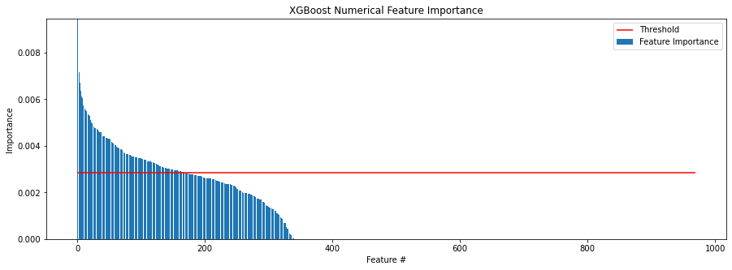
    


Bottom line, we can throw away 2/3 of the numerical features directly, but we could reduce even more by dropping everything below a threshold (0.3 of the max value for instance above)


```python
num_feats_to_keep = xgb_imp[xgb_imp['importance'] >= 0.3 * xgb_imp['importance'].max()]
```

### Retained Numerical Features - EDA


```python
# Keep only the features identified above
train_num = train_num[num_feats_to_keep['feature']]
```


```python
for line in ['L0', 'L1', 'L2', 'L3']:
    line_feats = np.sum([line in col for col in train_num.columns])
    print(f"Line {line}: {line_feats} features")
```

    Line L0: 63 features
    Line L1: 38 features
    Line L2: 13 features
    Line L3: 56 features
    


```python
stations = list(set([col.split('_')[1] for col in train_num.columns if 'S' in col ]))

station_feats = []
for station in stations:
    station_feats.append(np.sum([station == col.split('_')[1] for col in train_num.columns]))
    
plt.figure(figsize = (15, 4))
plt.bar(stations, station_feats);
plt.title(f"{len(stations)} Stations in the {len(train_num.columns)} numerical Features");
plt.xlabel('Station');
plt.ylabel('# Features');
plt.xticks(rotation = 90);

```


    
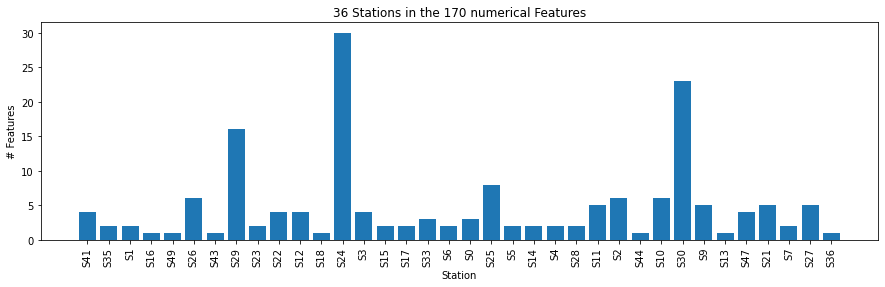
    


We have all 4 lines represented in the subset of numerical features, and around 15 stations. 
### Missing values
Let's have a closer look at missing values


```python
no_samples = train_num.shape[0]

(train_num.isna().sum()/no_samples * 100).plot(kind = 'bar', xticks = [], figsize = (20, 4), 
                                               title = '% Missing - Numerical',
                                               xlabel = 'Numerical Feature',
                                               ylabel = '% Missing');
```


    

    


There are still features with very high number of missing values. The pattern of missing values possibly holds some valuable information.

Let's have a look at the missing data patterns between the different numerical features


```python
def get_redundant_pairs(df):
    '''Get diagonal and lower triangular pairs of correlation matrix'''
    
    pairs_to_drop = set()
    cols          = df.columns
    
    for i in range(0, df.shape[1]):
        for j in range(0, i + 1):
            pairs_to_drop.add((cols[i], cols[j]))
    
    return pairs_to_drop

def get_correlations(df):
    
    au_corr = df.corr().unstack()
    to_drop = get_redundant_pairs(df)
    au_corr = au_corr.drop(labels = to_drop).sort_values(ascending = False).reset_index()
    au_corr.columns = ['feat1', 'feat2', 'corr']
    
    return au_corr
```


```python
# Make binary matrices indicating nans
num_nan     = train_num.isnull()

# Compute Pearson correlation for all, and positive / negative response separately

nan_pos_corr = get_correlations(num_nan[y_train == 1])
nan_neg_corr = get_correlations(num_nan[y_train == 0])
nan_corr     = get_correlations(num_nan)

# Save in case we nee them
nan_pos_corr.to_csv('./nan_pos_corr.csv')
nan_neg_corr.to_csv('./nan_neg_corr.csv')
nan_corr.to_csv('./nan_corr.csv')

nan_corr = pd.concat([nan_corr.set_index(['feat1', 'feat2']), 
                      nan_pos_corr.set_index(['feat1', 'feat2']), 
                      nan_neg_corr.set_index(['feat1', 'feat2'])], 
                     axis = 1)

nan_corr.columns = ['corr_all', 'corr_pos', 'corr_neg']

# Plot
fig, (ax1, ax2, ax3) = plt.subplots(nrows = 1, ncols = 3, figsize = (18, 4))
ax1.hist(nan_corr['corr_all']);
ax1.set_xlabel('Pearson Correlation Coefficient')
ax1.set_ylabel('# Occurences')
ax1.set_title('Missing Values - Pearson Correlation');

ax2.hist(nan_corr['corr_pos']);
ax2.set_xlabel('Pearson Correlation Coefficient')
ax2.set_ylabel('# Occurences')
ax2.set_title('Missing Values - Pearson Correlation (y = 1)');

ax3.hist(nan_corr['corr_neg']);
ax3.set_xlabel('Pearson Correlation Coefficient')
ax3.set_ylabel('# Occurences')
ax3.set_title('Missing Values - Pearson Correlation (y = 0)');

plt.figure(figsize = (18, 4))
plt.hist(np.abs(nan_corr['corr_pos'] - nan_corr['corr_neg']), bins = 50);
plt.xlabel('Pearson Correlation on missing values: Positive & Negative Response Diff.')
plt.ylabel('# Occurences')
plt.title('Missing Values - Pearson Correlation');

```


    
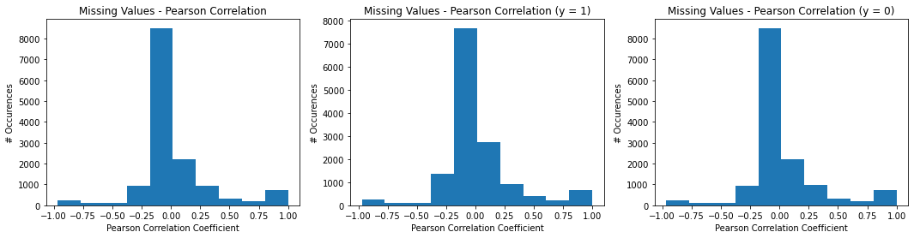
    


    
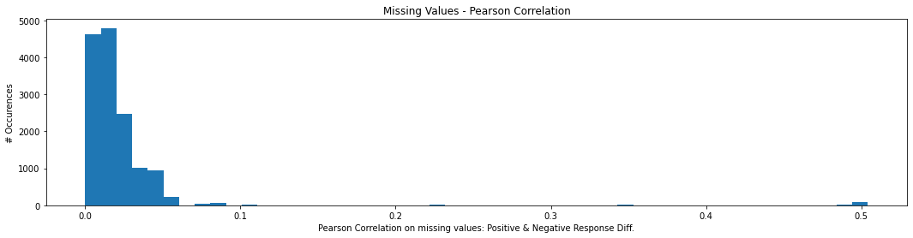
    


There are a few variable pairs which seem to be missing together most of the time (Pearson coefficient equal to 1), and variable pairs which miss alternately (Pearson coefficient equal to -1). Furthermore, there are a few variable pairs for which the Pearson coefficients are very different for the two different responses.
Missing data patterns are very important here. We could add new features, but XGBoost can handle this logic internally.

Considering features with similar missing data patterns (Pearson correlation higher than 0.95), we can also check if their values are correlated:


```python

# Grab feature pairs with highly correlated missing values (>= 0.95 Pearson correlation)
feats_mis_2 = nan_corr[nan_corr['corr_all'] >= 0.95].reset_index()[['feat1', 'feat2']].values

# Empty array to hold results for Spearman rank coefficient
spearman_vals = np.empty((feats_mis_2.shape[0], 1))
idx = 0

# Loop through all the features
for [feat1, feat2] in tqdm(feats_mis_2):
    
    # Grab the two features from the dataframe
    tmp = train_num[[feat1, feat2]].copy().dropna(axis = 0, how = 'any').values
    
    # Compute Spearman rank coefficient
    spearman_vals[idx], _ = spearmanr(tmp[:, 0], tmp[:, 1])
    
    # Increment
    idx += 1

corr_val = pd.DataFrame(np.append(feats_mis_2, spearman_vals, 1), columns = ['feat1', 'feat2', 'corr'])

# Save for later
corr_val.to_csv('./corr_val.csv')

```


      0%|          | 0/643 [00:00<?, ?it/s]


Let's remove any highly correlated features:


```python
corr_val = pd.read_csv('./corr_val.csv', index_col = 0)

# Compute absolute correlations
corr_val['abs_corr'] = corr_val['corr'].abs()

# Grab the redundant features
feats_to_remove = list(set(corr_val[corr_val['abs_corr'] >= 0.95]['feat2'].to_list()))

# Remove them
to_drop = [col for col in feats_to_remove if col in train_num.columns]
train_num.drop(to_drop, axis = 1, inplace = True)
holdout_num = holdout_num[train_num.columns]

```

We've reduced the numerical features from approximately 1000 to 263. Not bad
### Duplicates

Let's have a look if there are any duplicate rows in the numerical features. With over 1 million rows it wouldn't be surprising


```python
# Get indices of duplicate rows
dup_ids = train_num.duplicated(keep = False)
print(f'No Duplicate rows in numerical features: {np.sum(dup_ids) // 2}')
```

    No Duplicate rows in numerical features: 30873
    

Let's have a closer look at those. Perhaps removing them will make the class imbalance more severe:


```python
num_dupes = train_num.loc[dup_ids.index[dup_ids == True]]
num_dupes.insert(loc = 0, column = 'Response', value = y_train[dup_ids == True])
num_dupes[num_dupes['Response'] == 1].sort_index().head()
```

<table border="1" class="dataframe">
  <thead>
    <tr style="text-align: right;">
      <th></th>
      <th>Response</th>
      <th>L1_S24_F1713</th>
      <th>L1_S25_F2016</th>
      <th>L3_S30_F3589</th>
      <th>L1_S24_F1609</th>
      <th>L3_S29_F3433</th>
      <th>L0_S12_F342</th>
      <th>L3_S30_F3774</th>
      <th>L1_S24_F1441</th>
      <th>L3_S29_F3461</th>
      <th>...</th>
      <th>L0_S22_F586</th>
      <th>L0_S2_F60</th>
      <th>L3_S29_F3339</th>
      <th>L3_S47_F4153</th>
      <th>L3_S47_F4138</th>
      <th>L0_S12_F350</th>
      <th>L0_S12_F346</th>
      <th>L0_S6_F132</th>
      <th>L0_S11_F302</th>
      <th>L0_S18_F439</th>
    </tr>
    <tr>
      <th>Id</th>
      <th></th>
      <th></th>
      <th></th>
      <th></th>
      <th></th>
      <th></th>
      <th></th>
      <th></th>
      <th></th>
      <th></th>
      <th></th>
      <th></th>
      <th></th>
      <th></th>
      <th></th>
      <th></th>
      <th></th>
      <th></th>
      <th></th>
      <th></th>
      <th></th>
    </tr>
  </thead>
  <tbody>
    <tr>
      <th>1250</th>
      <td>1.0</td>
      <td>NaN</td>
      <td>NaN</td>
      <td>0.035</td>
      <td>NaN</td>
      <td>-0.076</td>
      <td>NaN</td>
      <td>-0.071</td>
      <td>NaN</td>
      <td>-0.040</td>
      <td>...</td>
      <td>NaN</td>
      <td>NaN</td>
      <td>0.002</td>
      <td>NaN</td>
      <td>NaN</td>
      <td>NaN</td>
      <td>NaN</td>
      <td>NaN</td>
      <td>-0.131</td>
      <td>NaN</td>
    </tr>
    <tr>
      <th>1793</th>
      <td>1.0</td>
      <td>NaN</td>
      <td>NaN</td>
      <td>-0.045</td>
      <td>NaN</td>
      <td>0.053</td>
      <td>NaN</td>
      <td>0.021</td>
      <td>NaN</td>
      <td>0.017</td>
      <td>...</td>
      <td>NaN</td>
      <td>NaN</td>
      <td>-0.012</td>
      <td>NaN</td>
      <td>NaN</td>
      <td>NaN</td>
      <td>NaN</td>
      <td>-0.112</td>
      <td>NaN</td>
      <td>NaN</td>
    </tr>
    <tr>
      <th>3585</th>
      <td>1.0</td>
      <td>NaN</td>
      <td>NaN</td>
      <td>NaN</td>
      <td>NaN</td>
      <td>0.065</td>
      <td>NaN</td>
      <td>0.091</td>
      <td>NaN</td>
      <td>0.417</td>
      <td>...</td>
      <td>NaN</td>
      <td>NaN</td>
      <td>0.256</td>
      <td>NaN</td>
      <td>NaN</td>
      <td>NaN</td>
      <td>NaN</td>
      <td>NaN</td>
      <td>NaN</td>
      <td>NaN</td>
    </tr>
    <tr>
      <th>4978</th>
      <td>1.0</td>
      <td>NaN</td>
      <td>NaN</td>
      <td>0.175</td>
      <td>NaN</td>
      <td>-0.076</td>
      <td>NaN</td>
      <td>-0.056</td>
      <td>NaN</td>
      <td>-0.040</td>
      <td>...</td>
      <td>NaN</td>
      <td>NaN</td>
      <td>0.079</td>
      <td>NaN</td>
      <td>NaN</td>
      <td>NaN</td>
      <td>NaN</td>
      <td>NaN</td>
      <td>NaN</td>
      <td>NaN</td>
    </tr>
    <tr>
      <th>5017</th>
      <td>1.0</td>
      <td>0.166</td>
      <td>NaN</td>
      <td>0.115</td>
      <td>NaN</td>
      <td>-0.002</td>
      <td>NaN</td>
      <td>-0.061</td>
      <td>NaN</td>
      <td>-0.040</td>
      <td>...</td>
      <td>NaN</td>
      <td>NaN</td>
      <td>0.027</td>
      <td>NaN</td>
      <td>NaN</td>
      <td>NaN</td>
      <td>NaN</td>
      <td>NaN</td>
      <td>NaN</td>
      <td>NaN</td>
    </tr>
  </tbody>
</table>
<p>5 rows × 165 columns</p>
</div>


Hold on. Rows 2-3 and 4-5 are clearly duplicates with an index difference of 1 (5017 - 5018, and 5177 - 5178). However. the first column (id = 1793) does not have a pair here. Let's find the previous index in the data:


```python
num_dupes.sort_index(inplace = True)
num_dupes.reset_index(inplace = True)
dupe_pair = num_dupes[(num_dupes['Id'] >= 1790) & (num_dupes['Id'] <= 1800)].sort_index()
dupe_pair
```

    C:\Users\kalika01\Anaconda\envs\pytorch_gpu\lib\site-packages\ipykernel_launcher.py:2: PerformanceWarning: DataFrame is highly fragmented.  This is usually the result of calling `frame.insert` many times, which has poor performance.  Consider joining all columns at once using pd.concat(axis=1) instead.  To get a de-fragmented frame, use `newframe = frame.copy()`
      
    


<div>
<style scoped>
    .dataframe tbody tr th:only-of-type {
        vertical-align: middle;
    }

    .dataframe tbody tr th {
        vertical-align: top;
    }

    .dataframe thead th {
        text-align: right;
    }
</style>
<table border="1" class="dataframe">
  <thead>
    <tr style="text-align: right;">
      <th></th>
      <th>Id</th>
      <th>Response</th>
      <th>L1_S24_F1713</th>
      <th>L1_S25_F2016</th>
      <th>L3_S30_F3589</th>
      <th>L1_S24_F1609</th>
      <th>L3_S29_F3433</th>
      <th>L0_S12_F342</th>
      <th>L3_S30_F3774</th>
      <th>L1_S24_F1441</th>
      <th>...</th>
      <th>L0_S22_F586</th>
      <th>L0_S2_F60</th>
      <th>L3_S29_F3339</th>
      <th>L3_S47_F4153</th>
      <th>L3_S47_F4138</th>
      <th>L0_S12_F350</th>
      <th>L0_S12_F346</th>
      <th>L0_S6_F132</th>
      <th>L0_S11_F302</th>
      <th>L0_S18_F439</th>
    </tr>
  </thead>
  <tbody>
    <tr>
      <th>48</th>
      <td>1793</td>
      <td>1.0</td>
      <td>NaN</td>
      <td>NaN</td>
      <td>-0.045</td>
      <td>NaN</td>
      <td>0.053</td>
      <td>NaN</td>
      <td>0.021</td>
      <td>NaN</td>
      <td>...</td>
      <td>NaN</td>
      <td>NaN</td>
      <td>-0.012</td>
      <td>NaN</td>
      <td>NaN</td>
      <td>NaN</td>
      <td>NaN</td>
      <td>-0.112</td>
      <td>NaN</td>
      <td>NaN</td>
    </tr>
    <tr>
      <th>49</th>
      <td>1794</td>
      <td>0.0</td>
      <td>NaN</td>
      <td>NaN</td>
      <td>-0.045</td>
      <td>NaN</td>
      <td>0.053</td>
      <td>NaN</td>
      <td>0.021</td>
      <td>NaN</td>
      <td>...</td>
      <td>NaN</td>
      <td>NaN</td>
      <td>-0.012</td>
      <td>NaN</td>
      <td>NaN</td>
      <td>NaN</td>
      <td>NaN</td>
      <td>-0.112</td>
      <td>NaN</td>
      <td>NaN</td>
    </tr>
  </tbody>
</table>
<p>2 rows × 166 columns</p>
</div>


Indeed, these two rows seem to be exactly the same apart from the response. Let's verify:


```python
all(dupe_pair.drop(['Id', 'Response'], axis = 1).fillna(0).diff().iloc[1] == 0)
```


    True


Indeed. Apart from the response (and the index) these two rows are equal. Let's see if this occurs somewhere else as well:


```python
dupes_x = (num_dupes.drop(['Id', 'Response'], axis = 1).fillna(0).diff().T == 0).all()
dupes_y = num_dupes['Response'].diff().T != 0
idx     = np.where(dupes_x & dupes_y)[0].tolist()
idx.extend([elem - 1 for elem in idx])

idx     = np.sort(idx)
num_dupes[['Id', 'Response']].iloc[idx].diff()[1::2].plot.hist();

```


    
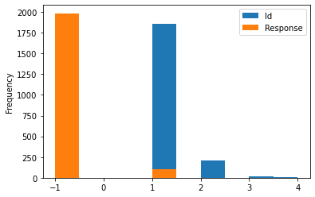
    


Yes, this happens throughout. So, we have confirmed that: Duplicate rows of the numeric features with an Id difference of +1 are very likely to have flipped response values.

Does this apply to non-duplicate rows as well?


```python
idr = pd.DataFrame(data = np.vstack([train_num.index.values, y_train]).T, 
                   columns = ['Id', 'Response'])
idr.sort_values(by = 'Id', inplace = True)
idr = idr.diff()[1::2]

print(idr[idr['Id'] == 1]['Response'].value_counts())
```

     0.0    236986
    -1.0      1271
     1.0      1265
    Name: Response, dtype: int64
    

No, not really. Transitions from a zero response, to a unity response or vice versa are pretty much the same.
Now, we need to encode this info on a set of features


```python
# Make a column indicating if a row is a duplicate
new_feats = df_num[train_num.columns].duplicated(keep = False).to_frame()
new_feats.columns = ['dupe']

# First-order differencing on index
new_feats['diffId'] = new_feats.index
new_feats['diffId'] = new_feats['diffId'].diff()

# Flag the second appearance of each duplicate row
new_feats['dupe_second_occur'] = df_num[train_num.columns].duplicated(keep = 'first')

# Add features
train_num   = pd.concat([train_num, new_feats.iloc[idx_trainval]], axis = 1)
holdout_num = pd.concat([holdout_num, new_feats.iloc[idx_hold]], axis = 1)

```

Let's add second order and interaction terms:


```python
train_num   = train_num.iloc[:, 0:167]
holdout_num = holdout_num.iloc[:, 0:167]
```


```python
# Multiply with 1e2 the initial features as everything is between 0 and 1
num_cols    = 164
train_num.iloc[:, 0:num_cols] = train_num.iloc[:, 0:num_cols] * 100
holdout_num.iloc[:, 0:num_cols] = holdout_num.iloc[:, 0:num_cols] * 100

# Make second order polynomial features
tmp         = train_num.iloc[:, 0:num_cols] ** 2
tmp.columns = [col + '_sq' for col in tmp.columns]
train_num   = pd.concat([train_num, tmp], axis = 1)

tmp         = holdout_num.iloc[:, 0:num_cols] ** 2
tmp.columns = [col + '_sq' for col in tmp.columns]
holdout_num = pd.concat([holdout_num, tmp], axis = 1)
```

## Date Features


```python
df_date = load_df(input_file = datadir + './train_date.csv.zip', d_type = np.float64, fill_value = np.nan, chunksize = 200000)
```


      0%|          | 0/6 [00:00<?, ?it/s]


Let's remove any constant columns:


```python
cols_drop = df_date.columns[df_date.nunique() <= 1]
df_date.drop(cols_drop, axis = 1, inplace = True)
```

### Record duration

Let's compute duration of each record (max - min) date time, starting time (min time), as well as transition times between consecutive stations. 
We'll do so in chunks so as not to run out of memory:


```python
na_count = df_date.isnull().sum(axis = 1).values
nonna    = df_date.shape[1] - na_count

# Empty arrays to hold results
dur  = np.empty((df_date.shape[0]))
min_ = np.empty((df_date.shape[0]))

# Chunksize for the computation
chunk_size = int(df_date.shape[0] / 20)

for start in tqdm(range(0, df_date.shape[0], chunk_size)):
    df_subset = df_date.iloc[start:start + chunk_size]
    dur[start:start + chunk_size]  = (df_subset.max(axis = 1) - df_subset.min(axis = 1)).values
    min_[start:start + chunk_size] = df_subset.min(axis = 1).values
```


      0%|          | 0/21 [00:00<?, ?it/s]


```python
plt.hist(dur[y == 0], 50, density = True, alpha = 0.5);
plt.hist(dur[y == 1], 50, density = True, alpha = 0.5);
plt.title('Record Duration');
plt.ylabel('Probability')
plt.xlabel('Time');
plt.xlim([0, 150]);
plt.legend(['response = 0', 'response = 1']);
```


    
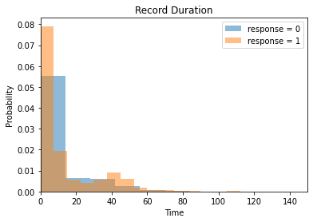
    


There's not that much of a difference. Perhaps duration divided by the number of recorded features might be more informative:


```python
plt.hist(dur[y == 0] / nonna[y == 0], 100, density = True, alpha = 0.5);
plt.hist(dur[y == 1] / nonna[y == 1], 100, density = True, alpha = 0.5);
plt.title('Record Duration / no. recorded values');
plt.ylabel('Probability')
plt.xlabel('Time');
plt.xlim([0, 0.6]);
plt.legend(['response = 0', 'response = 1']);
```


    
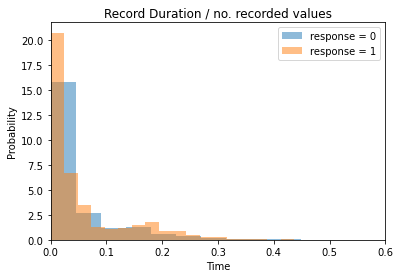
    


### Station transition sequence
Let's also encode the entire station-by-station sequence. Perhaps this holds useful info:


```python
def station_seq(date_df_row):
    
    # Sort by time and get index (original df column: line_station_feature)
    date_df_row = date_df_row.sort_values().dropna().to_frame().drop_duplicates().index
    
    # Make a sequence of stations from the index 
    seq = map(lambda x: str(x.split('_')[1].strip('S')), date_df_row)
    
    # Return unique while keeping order
    seq = list(dict.fromkeys(seq))
    
    return '_'.join(seq)
```


```python
tqdm.pandas()
transition_seq = df_date.progress_apply(lambda row: station_seq(row), axis = 1)
```


      0%|          | 0/1183747 [00:00<?, ?it/s]


Let's have a look:


```python
print(f"Unique station transitions: {len(transition_seq.unique())}")
```

    Unique station transitions: 42214
    

One-hot encoding is not the best option here.


```python
seq_to_plot = 50
transition_seq.value_counts().sort_values(ascending = False).head(seq_to_plot).plot.bar(
    xticks  = np.arange(seq_to_plot), 
    figsize = (15, 5),
    title   = '# Occurences of most frequent station-to-station transition sequences',
    xlabel  = 'Transition ID',
    ylabel  = '# Occurences'
);
```


    

    


Target encoding with additive smoothing is probably a good approach. There is information leak since we're doing this outside of resampling, but with so much data it should not be a problem:


```python
def calc_smooth_mean(df, by, on, m):
    '''
    Credit: https://maxhalford.github.io/blog/target-encoding/
    '''
    
    # Compute the global mean
    mean = df[on].mean()

    # Compute the number of values and the mean of each group
    agg    = df.groupby(by)[on].agg(['count', 'mean'])
    counts = agg['count']
    means  = agg['mean']

    # Compute the "smoothed" means
    smooth = (counts * means + m * mean) / (counts + m)

    # Replace each value by the according smoothed mean
    return df[by].map(smooth)
```


```python
# Convert to dataframe and add target
transition_seq = transition_seq.to_frame()
transition_seq.columns   = ['sequence']
transition_seq['target'] = y

# Run encoder
transition_seq['seq_encoded'] = calc_smooth_mean(transition_seq, by = 'sequence', on = 'target', m = 3000)
```

### Station Duration
Let's also compute duration at each station for each record. This will be defined as the time difference between the first and last recorded feature:


```python
stations = list(set([col.split('_')[1] for col in df_date.columns]))
station_durs = []

for station in stations:
    
    # Grab features referring to this station only
    station_cols = [col for col in df_date.columns if station == col.split('_')[1]]
    df_temp      = df_date[station_cols]
    
    # Compute duration and append
    station_dur  = df_temp.max(axis = 1) - df_temp.min(axis = 1)
    station_dur = station_dur.to_frame()
    station_dur.columns = [station]
    station_durs.append(station_dur)

station_durs = pd.concat(station_durs, axis = 1)
```

Let's also drop any constant columns that arise from this:


```python
# Get columns containing constant values
cols_to_drop = station_durs.columns[station_durs.nunique() <= 1]

# Drop them
station_durs.drop(cols_to_drop, axis = 1, inplace = True)
```

Alright, let's make the new dataframe with all the date features


```python
# Get station durations
df_date_new = station_durs.copy()

# Add otal duration
df_date_new['total_dur'] = dur

# Add initial date
df_date_new['date_min'] = min_

# Add the encoded transition sequence
df_date_new['transition_seq'] = transition_seq['seq_encoded'].values

# Add no missing
df_date_new['na_count'] = na_count
```

Let's have a closer look at the starting dates. Perhaps there's more info rearding the response (same way there was info in the Id column of the numerical features). 


```python
plt.figure(figsize = (15, 5))
plt.plot(np.arange(df_date_new.shape[0]), df_date_new['date_min'].sort_values())
plt.xlabel('Record #');
plt.ylabel('Sorted Start Date');
plt.title('Starting date of each record');
```


    
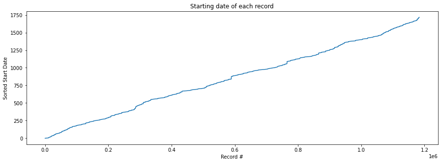
    


Same starting days seem to be appearing in different records (the small jumps on the graph above). Let's plot the number of occurences of each starting date


```python
start_dates = df_date_new['date_min'].value_counts().reset_index().sort_values(by = 'index')
start_dates.columns = ['time', 'cnt']

plt.figure(figsize = (15, 5))
plt.scatter(start_dates['time'], start_dates['cnt'], marker = '.')
plt.xlabel('Starting Date');
plt.ylabel('# Occurences');
plt.title('# Occurences of record starting date');
print('Timestamp granularity range:', start_dates['time'].diff().min(), start_dates['time'].diff().max())
print('Timestamp granularity median:', start_dates['time'].diff().median())
```

    Timestamp granularity range: 0.009999999999990905 12.659999999999854
    Timestamp granularity median: 0.009999999999990905
    


    
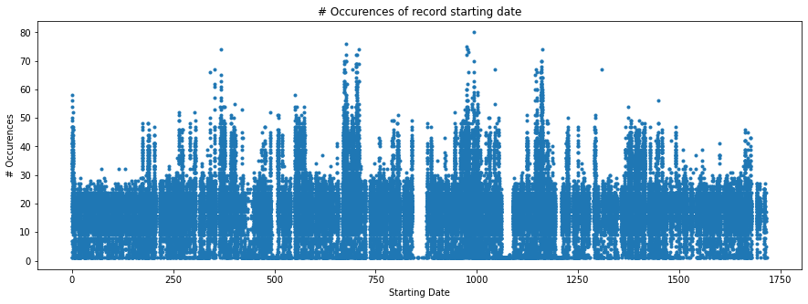
    


We have records every 0.01 units of time, with the big gap in the middle of graph being equal to 12.66 units of time.
There also seems to be some periodicity in the graph. Let's check for autocorrelations:


```python
# Make a dataframe with equally spaced times w/ a granularity of 0.01
times_regular = pd.DataFrame(data = np.arange(start_dates['time'].min(), start_dates['time'].max(), 0.01), 
                             columns = ['time'])

# Merge with the value counts & fill NaNs by zero
time_counts = start_dates.merge(times_regular, how = 'right', on = 'time').fillna(0)

# Autocorrelation
x         = time_counts['cnt'].values
max_lag   = 6000
auto_corr = np.array([np.corrcoef(x[: -lag], x[lag:])[0, 1] for lag in range(1, max_lag)])

# Plot
fig = plt.figure(figsize = (15, 5))
plt.plot(auto_corr, '.')
for k in range(1, 4):
    plt.vlines(x = 1680 * k, ymin = auto_corr.min(), ymax = auto_corr.max(), color = 'r')
plt.title('# Occurences of record starting date - Auto-correlation');
plt.ylabel('PPMCC');
plt.xlabel('Lag');

```


    
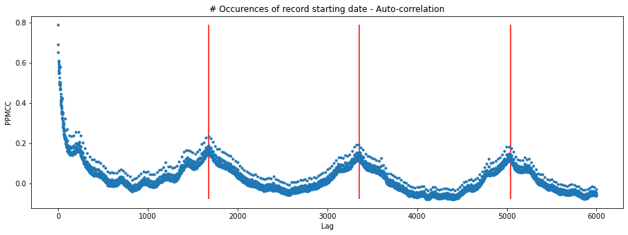
    


The highest autocorrelation occurs approximately every 1680 units of time (1 unit of time = 0.01). Perhaps day number will be a useful feature:


```python
day_time = 1680 * 0.01 # Units of time in one day(?)
df_date_new['start_day_no'] = df_date_new['date_min'] // day_time
df_date_new['end_day_no']   = (df_date_new['date_min'] + df_date_new['total_dur']) // day_time
```


```python
# Make train and holdout sets
train_date   = df_date_new.iloc[idx_trainval]
holdout_date = df_date_new.iloc[idx_hold]
```

## Categorical Features


```python
df_cat = load_df(input_file = datadir + 'train_categorical.csv.zip', d_type = str, fill_value = np.nan, chunksize = 100000)
df_cat.shape
```


      0%|          | 0/12 [00:00<?, ?it/s]


    (1183747, 2140)


An additional 2140 categorical features. Let's check missing data patterns:


```python
no_samples = df_cat.shape[0]

(df_cat.isna().sum()/no_samples * 100).plot(kind = 'bar', xticks = [], figsize = (15, 4), 
                                            title = '% Missing - Categorical',
                                            xlabel = 'Categorical Feature',
                                            ylabel = '% Missing');
```


    
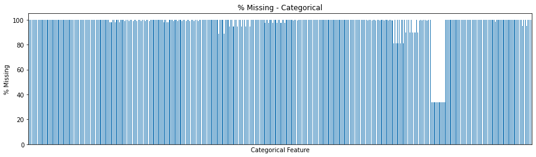
    


Apart from a few features with 40% missing records, everything else has a missing ratio of more than 80%. Let's drop columns with all missing:


```python
cols_drop = df_cat.columns[df_cat.isna().all()]
df_cat.drop(cols_drop, axis = 1, inplace = True)
df_cat.shape
```


    (1183747, 1977)


We got rid of around 40 columns...
Perhaps we could aggreggate categorical features per station:

The character T appears in every non-nan cell, followed by a number (probably an ID), let's get rid of it and convert the datatype:


```python
df_cat = df_cat.apply(lambda col: col.map(lambda cell: str(cell).lstrip('T') if isinstance(cell, str) else cell))
df_cat = df_cat.astype(float)
```

We will compute the number of non-missing values on a station level, and we'll drop the original dataframe


```python
# Grab all stations appearing in the categorical features
cat_stations = np.unique([col.split('_')[1] for col in df_cat.columns])

# List to hold results
res = []

for station in tqdm(cat_stations):
    
    # Grab columns for this station
    cols    = [col for col in df_cat.columns if station == col.split('_')[1]]
    
    # Number of non-missing values in each row for this station
    no_nan = df_cat[cols].notna().sum(axis = 1)
    no_nan = no_nan.to_frame()
    no_nan.columns = [station]
    
    res.append(no_nan)
    
df_cat_new = pd.concat(res, axis = 1).astype(int)

# Make train and holdout sets
train_cat   = df_cat_new.iloc[idx_trainval]
holdout_cat = df_cat_new.iloc[idx_hold]
```


      0%|          | 0/31 [00:00<?, ?it/s]


## Make and save datasets

Let's make a checkpoint here with the final datasets:


```python
# Make datasets
X_train   = csr_matrix( pd.concat( [train_num, train_date, train_cat], axis = 1).values )
X_holdout = csr_matrix( pd.concat( [holdout_num, holdout_date, holdout_cat], axis = 1).values )
```


```python
# Make checkpoint
save_list = [X_train, X_holdout, y_train, y_holdout, skf]
file_name = "./datasets.pkl"
open_file = open(file_name, "wb")
pickle.dump(save_list, open_file)
open_file.close()
```

## Modelling

### Load the datasets


```python
# Load checkpoint
file_name = "./datasets.pkl"
open_file = open(file_name, "rb")
X_train, X_holdout, y_train, y_holdout, skf = pickle.load(open_file)
open_file.close()
```

### Evaluation metric

We need a function to compute the Matthews Correlation Coefficient (MCC) in an efficient way for xgboost. We'll use some numba magic for this, so as to optimise the threshold probability as well:


```python
@jit(nopython = True)
def mcc(tp, tn, fp, fn):
    sup = tp * tn - fp * fn
    inf = (tp + fp) * (tp + fn) * (tn + fp) * (tn + fn)
    
    if inf == 0:
        return 0
    else:
        return sup / np.sqrt(inf)

@jit(nopython = True)
def eval_mcc(y_true, y_prob):
    
    # Sort arrays
    idx         = np.argsort(y_prob)
    y_true_sort = y_true[idx]
    
    # Get # samples
    n = y_true.shape[0]
    
    # Get no. positive and no. negative
    nump = 1.0 * np.sum(y_true) # number of positive
    numn = n - nump # number of negative
    
    tp = nump
    tn = 0.0
    fp = numn
    fn = 0.0
    
    best_mcc   = 0.0
    best_id    = -1
    prev_proba = -1
    best_proba = -1
    
    # Initialise array for results
    mccs = np.zeros(n)
    
    for i in range(n):
        # all items with idx < i are predicted negative while others are predicted positive
        # only evaluate mcc when probability changes
        proba = y_prob[idx[i]]
        
        if proba != prev_proba:
            
            prev_proba = proba
            new_mcc    = mcc(tp, tn, fp, fn)
            
            if new_mcc >= best_mcc:
                
                best_mcc   = new_mcc
                best_id    = i
                best_proba = proba
                
        mccs[i] = new_mcc
        
        if y_true_sort[i] == 1:
            tp -= 1.0
            fn += 1.0
        else:
            fp -= 1.0
            tn += 1.0
    
    return best_mcc

# Evaluation metric compatible with xgboost api
def mcc_eval(y_prob, dtrain):
    
    y_true   = dtrain.get_label()
    best_mcc = eval_mcc(y_true, y_prob)
    
    return 'MCC', best_mcc
```

Let't time it:


```python
y_prob0 = np.random.rand(1000000)
y_prob  = y_prob0 + 0.4 * np.random.rand(1000000) - 0.02
y_true  = (y_prob0 > 0.6).astype(int)

%timeit eval_mcc(y_true, y_prob)

del y_prob0, y_prob, y_true
gc.collect();
```

    168 ms ± 16.5 ms per loop (mean ± std. dev. of 7 runs, 1 loop each)
    

### k-fold CV

We'll use xgboost as the learning algorithm. Let's write a wrapper to perform k-fold CV and return the average validation MCC:


```python
def CV(X_train, y_train, skf, eta, gamma, max_depth, num_boost_round, subsample, colsample_bytree, alpha, lamda):
    
    # Early stopping
    early_stopping_rounds = 10

    # Make parameter dict for xgboost
    xgb_params = {"nthread": -1, "booster":"gbtree", "objective": "binary:logistic", 
                  "eval_metric": "auc", "tree_method": "hist", "eta": eta, "gamma": gamma, 
                  "max_depth": int(max_depth), "subsample": subsample,
                  "colsample_bytree": colsample_bytree, "alpha": alpha, "lambda": lamda}
    
    # Run CV with the given parameters
    scores = []
    for train_idx, val_idx in skf.split(np.zeros(y_train.shape[0]), y_train):

        # Make train and validation sets for this fold
        X_train_, y_train_ = X_train[train_idx, :], y_train[train_idx]
        X_val_, y_val_     = X_train[val_idx, :], y_train[val_idx]

        # Make dmatrix
        dtrain = xgb.DMatrix(X_train_, y_train_)
        dval   = xgb.DMatrix(X_val_, y_val_)

        # Scale positive instances
        sum_neg, sum_pos = np.sum(y_train_ == 0), np.sum(y_train_ == 1)
        xgb_params["scale_pos_weight"] = sum_neg / sum_pos

        # Train using the parameters
        bst = xgb.train(params = xgb_params,
                        dtrain = dtrain,
                        feval  = mcc_eval,
                        evals  = [ (dtrain, 'train'), (dval, 'eval') ],
                        maximize = True,
                        verbose_eval = False,
                        num_boost_round = int(num_boost_round),
                        early_stopping_rounds = early_stopping_rounds)

        # Grab the best score on the validation set
        scores.append(bst.best_score)
        
    return np.mean(scores)
```

Now, we can perform hyperparameter tuning:


```python
# Make parameter set for Tree booster
params = {
    "eta": (0.05, 0.3), 
    "gamma": (0, 100),
    "max_depth": (5, 50), 
    "num_boost_round": (10, 100), 
    "subsample": (0.5, 0.95), 
    "colsample_bytree": (0.5, 0.95), 
    "alpha": (0, 10), 
    "lamda": (0, 10)} 

# Function handle
f = partial(CV, X_train, y_train, skf)

optimizer = BayesianOptimization(f, params, random_state = 111)
optimizer.maximize(init_points = 20, n_iter = 10)

```

    |   iter    |  target   |   alpha   | colsam... |    eta    |   gamma   |   lamda   | max_depth | num_bo... | subsample |
    -------------------------------------------------------------------------------------------------------------------------
    |  1        |  0.2763   |  6.122    |  0.5761   |  0.159    |  76.93    |  2.953    |  11.71    |  12.02    |  0.6891   |
    |  2        |  0.2893   |  2.387    |  0.6519   |  0.2977   |  23.77    |  0.8119   |  35.13    |  65.91    |  0.6234   |
    |  3        |  0.3089   |  4.662    |  0.5533   |  0.06849  |  90.08    |  7.94     |  42.83    |  83.37    |  0.9459   |
    |  4        |  0.2689   |  5.773    |  0.8662   |  0.1553   |  2.745    |  4.541    |  9.74     |  83.55    |  0.814    |
    |  5        |  0.3226   |  5.653    |  0.6234   |  0.2996   |  13.8     |  6.154    |  26.83    |  46.45    |  0.8275   |
    |  6        |  0.2902   |  3.228    |  0.6802   |  0.1297   |  94.72    |  9.187    |  41.62    |  13.07    |  0.9245   |
    |  7        |  0.262    |  9.504    |  0.863    |  0.1703   |  96.68    |  4.17     |  19.35    |  11.48    |  0.5172   |
    |  8        |  0.2773   |  0.5309   |  0.5576   |  0.05835  |  22.64    |  5.439    |  13.04    |  26.14    |  0.5673   |
    |  9        |  0.3113   |  6.83     |  0.7111   |  0.2421   |  66.88    |  4.413    |  31.79    |  51.55    |  0.9335   |
    |  10       |  0.2662   |  1.478    |  0.9081   |  0.1745   |  59.25    |  6.847    |  12.99    |  87.82    |  0.7169   |
    |  11       |  0.2749   |  0.6934   |  0.6641   |  0.1404   |  47.21    |  1.795    |  12.89    |  95.42    |  0.7951   |
    |  12       |  0.2736   |  1.35     |  0.9175   |  0.2604   |  5.278    |  2.037    |  44.26    |  70.65    |  0.6338   |
    |  13       |  0.2941   |  7.344    |  0.7783   |  0.1026   |  80.21    |  0.5911   |  18.87    |  28.66    |  0.9375   |
    |  14       |  0.2784   |  9.094    |  0.8044   |  0.0788   |  95.8     |  0.9171   |  33.34    |  91.26    |  0.6529   |
    |  15       |  0.2653   |  6.528    |  0.9163   |  0.1435   |  77.14    |  8.962    |  32.91    |  23.6     |  0.6687   |
    |  16       |  0.2946   |  6.358    |  0.7066   |  0.1831   |  35.23    |  6.599    |  26.44    |  50.91    |  0.5562   |
    |  17       |  0.289    |  4.125    |  0.6229   |  0.1367   |  97.44    |  2.156    |  35.73    |  12.86    |  0.8759   |
    |  18       |  0.27     |  7.017    |  0.9347   |  0.198    |  21.73    |  7.192    |  6.389    |  47.68    |  0.6266   |
    |  19       |  0.2975   |  1.062    |  0.6919   |  0.2601   |  11.04    |  9.867    |  15.5     |  74.93    |  0.7974   |
    |  20       |  0.2833   |  0.7776   |  0.8138   |  0.1163   |  90.18    |  8.183    |  22.97    |  83.83    |  0.589    |
    |  21       |  0.3334   |  6.459    |  0.5462   |  0.2506   |  36.25    |  6.777    |  25.78    |  49.77    |  0.9422   |
    |  22       |  0.3012   |  4.741    |  0.7108   |  0.1743   |  13.35    |  7.41     |  26.38    |  48.17    |  0.7132   |
    |  23       |  0.2815   |  3.441    |  0.8176   |  0.1366   |  14.58    |  4.772    |  25.93    |  46.8     |  0.5528   |
    |  24       |  0.279    |  3.108    |  0.8705   |  0.1189   |  87.29    |  8.282    |  41.84    |  83.65    |  0.6098   |
    |  25       |  0.2937   |  6.576    |  0.86     |  0.2396   |  34.55    |  6.366    |  25.5     |  50.53    |  0.7603   |
    |  26       |  0.2701   |  5.059    |  0.8118   |  0.09802  |  36.69    |  8.31     |  26.07    |  51.84    |  0.6583   |
    |  27       |  0.2943   |  4.404    |  0.6211   |  0.2609   |  36.23    |  7.353    |  23.56    |  47.98    |  0.667    |
    |  28       |  0.2895   |  1.508    |  0.6033   |  0.1134   |  12.35    |  9.101    |  16.4     |  75.78    |  0.7704   |
    |  29       |  0.3153   |  5.752    |  0.6329   |  0.1538   |  14.05    |  7.219    |  28.18    |  45.32    |  0.7804   |
    |  30       |  0.2692   |  5.248    |  0.9104   |  0.1756   |  15.03    |  5.825    |  26.13    |  49.58    |  0.5196   |
    =========================================================================================================================
    

Let's train the best model on all the data:


```python
# Make dmatrices
dtrain = xgb.DMatrix(X_train, y_train)
dheld  = xgb.DMatrix(X_holdout, y_holdout.to_numpy())

# Scale positive instances
sum_neg, sum_pos = np.sum(y_train == 0), np.sum(y_train == 1)

# Make parameter dict for xgboost
xgb_params = {"nthread": -1, "booster":"gbtree", "objective": "binary:logistic", "eval_metric": "auc", "tree_method": "hist",
              "eta":              optimizer.max["params"]["eta"], 
              "gamma":            optimizer.max["params"]["gamma"], 
              "max_depth":        int(optimizer.max["params"]["max_depth"]), 
              "subsample":        optimizer.max["params"]["subsample"],
              "alpha":            optimizer.max["params"]["alpha"], 
              "lambda":           optimizer.max["params"]["lamda"],
              "colsample_bytree": optimizer.max["params"]["colsample_bytree"],
             "scale_pos_weight" : sum_neg / sum_pos}

# Train using the parameters
clf = xgb.train(params = xgb_params,
                dtrain = dtrain,
                feval  = mcc_eval,
                evals  = [(dtrain, 'train')],
                maximize = True,
                verbose_eval = False,
                num_boost_round = int(optimizer.max["params"]["num_boost_round"]),
                early_stopping_rounds = 10)
```

Let's predict on the heldout set and compute the MCC:


```python
y_prob = clf.predict(dheld)
print(f"Heldout Set MCC: {round(eval_mcc(y_holdout.to_numpy(), y_prob), 3)}")
```

    Heldout Set MCC: 0.485
    
